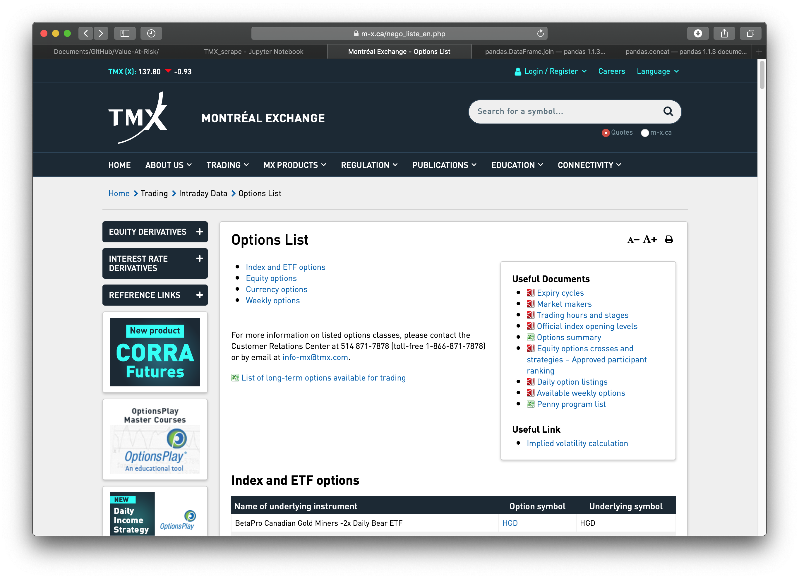
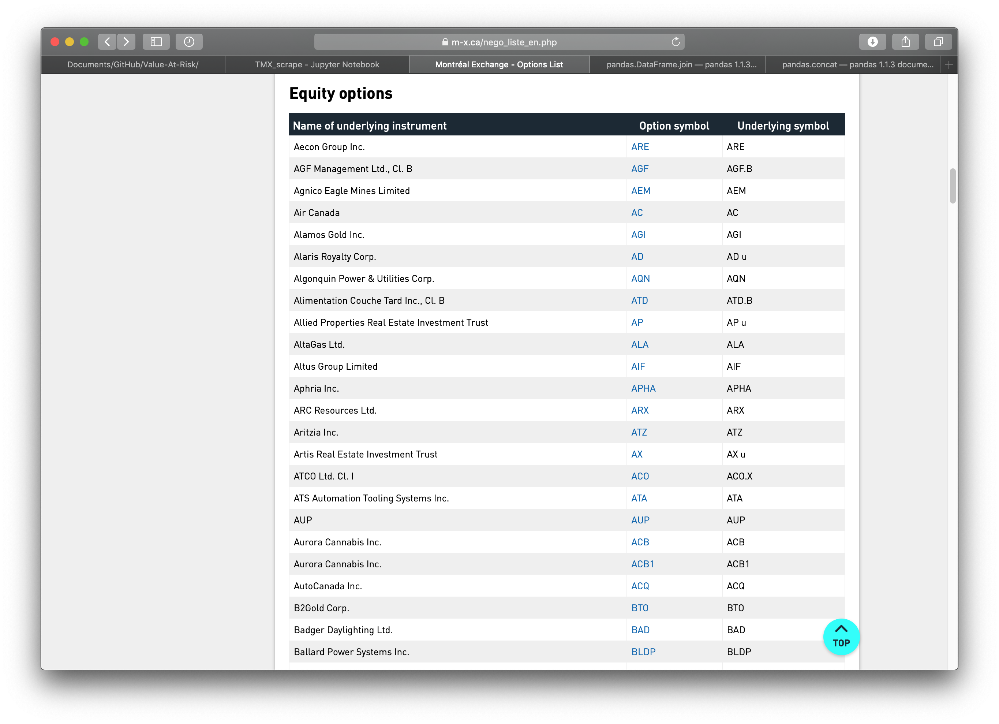
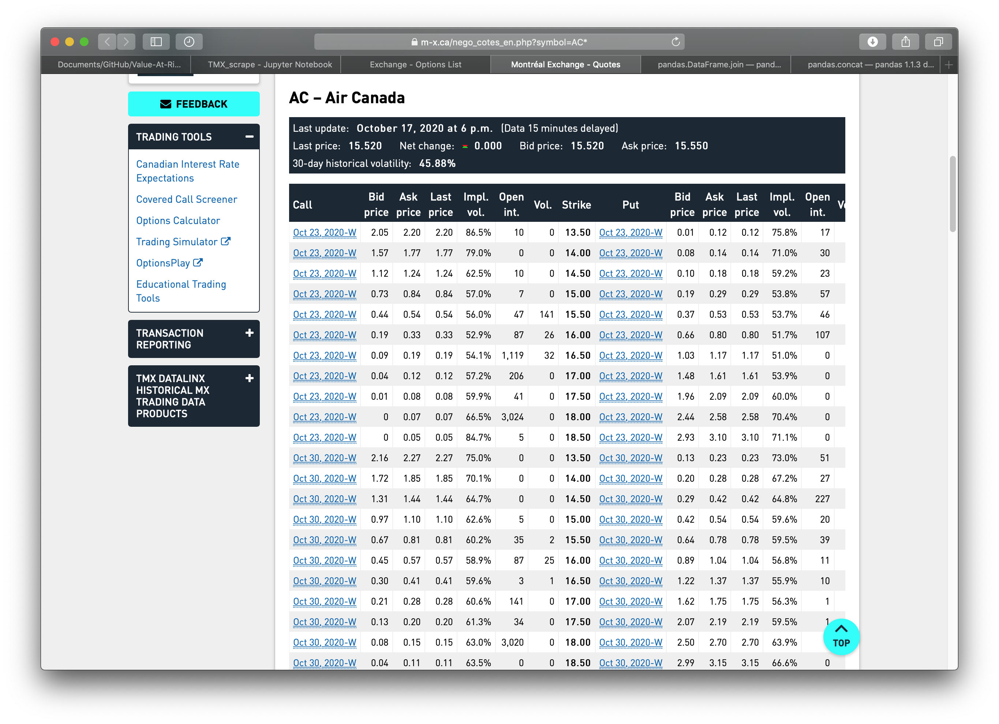

# Montreal Exchange (TMX) 

The [Montreal Exchange](https://www.m-x.ca/accueil_en.php) is the oldest exchange in Canada and has a very important history to Canada's economy. Taken from Wikipedia,  

>The Montreal Exchange, formerly the Montreal Stock Exchange (MSE), is a derivatives exchange, located in Montreal, Quebec, Canada that trades futures contracts and options on equities, indices, currencies, ETFs, energy and interest rates. Since 1965, it has been located in the Tour de la Bourse (Stock Exchange Tower), Montreal's third-tallest building. It is owned by the Toronto-based TMX Group.

This README file is to showcase the functionality of this small web scraping module. It can be used to get options prices, both calls and puts for index and ETF options, equity options, currency options, and weekly options.

These prices are then displayed in a Pandas Dataframe for further analysis. This could include simple plots for visualizing the data or creating machine learning model or neural network to predict future prices. One could also use [Black-Scholes](https://en.wikipedia.org/wiki/Black–Scholes_model) model to gain further insight.

---

# Requirements  
1. *Python* **3.8.5** (older version will work buy must be Python 3+)  
2. *Pandas* **1.1.2** (older version will probably work)  
3. *Requests* **2.23.0** (older version will probably work)  
4. *bs4* **4.9.3** (for BeautifulSoup)  

---

We start by showing a list of options available from [TMX](https://m-x.ca/nego_liste_en.php). There is one parameter for the function `get_list()` and it can take one of four stings:  

'Index'/'ETF', 'Equity', 'Currency', or 'Weekly'.

The webpage looks like:   


```python
get_list('equity')
```


<div>
<style scoped>
    .dataframe tbody tr th:only-of-type {
        vertical-align: middle;
    }

    .dataframe tbody tr th {
        vertical-align: top;
    }

    .dataframe thead th {
        text-align: right;
    }
</style>
<table border="1" class="dataframe">
  <thead>
    <tr style="text-align: right;">
      <th></th>
      <th>Name of underlying instrument</th>
      <th>Option symbol</th>
      <th>Underlying symbol</th>
    </tr>
  </thead>
  <tbody>
    <tr>
      <th>0</th>
      <td>Aecon Group Inc.</td>
      <td>ARE</td>
      <td>ARE</td>
    </tr>
    <tr>
      <th>1</th>
      <td>AGF Management Ltd., Cl. B</td>
      <td>AGF</td>
      <td>AGF.B</td>
    </tr>
    <tr>
      <th>2</th>
      <td>Agnico Eagle Mines Limited</td>
      <td>AEM</td>
      <td>AEM</td>
    </tr>
    <tr>
      <th>3</th>
      <td>Air Canada</td>
      <td>AC</td>
      <td>AC</td>
    </tr>
    <tr>
      <th>4</th>
      <td>Alamos Gold Inc.</td>
      <td>AGI</td>
      <td>AGI</td>
    </tr>
    <tr>
      <th>...</th>
      <td>...</td>
      <td>...</td>
      <td>...</td>
    </tr>
    <tr>
      <th>264</th>
      <td>Wheaton Precious Metals Corp.</td>
      <td>WPM</td>
      <td>WPM</td>
    </tr>
    <tr>
      <th>265</th>
      <td>Whitecap Resources Inc.</td>
      <td>WCP</td>
      <td>WCP</td>
    </tr>
    <tr>
      <th>266</th>
      <td>Winpak Ltd.</td>
      <td>WPK</td>
      <td>WPK</td>
    </tr>
    <tr>
      <th>267</th>
      <td>WSP Global Inc.</td>
      <td>WSP</td>
      <td>WSP</td>
    </tr>
    <tr>
      <th>268</th>
      <td>Yamana Gold Inc.</td>
      <td>YRI</td>
      <td>YRI</td>
    </tr>
  </tbody>
</table>
<p>269 rows × 3 columns</p>
</div>


The above DataFrame that we get with `get_list('equity')` is from:
  

Now we can grab stock prices for Air Canada (ticker symbol AC) so we can compare them to the stock options:


```python
get_stock('AC')
```


<div>
<style scoped>
    .dataframe tbody tr th:only-of-type {
        vertical-align: middle;
    }

    .dataframe tbody tr th {
        vertical-align: top;
    }

    .dataframe thead th {
        text-align: right;
    }
</style>
<table border="1" class="dataframe">
  <thead>
    <tr style="text-align: right;">
      <th></th>
      <th>TICKER</th>
      <th>Last price</th>
      <th>Net change</th>
      <th>Bid price</th>
      <th>Ask price</th>
    </tr>
  </thead>
  <tbody>
    <tr>
      <th>0</th>
      <td>AC</td>
      <td>15.520</td>
      <td>0.000</td>
      <td>15.520</td>
      <td>15.550</td>
    </tr>
  </tbody>
</table>
</div>


We can also input a list of stock symbols to get a Pandas DataFrame of said stocks:


```python
get_stock(['AC','ARE'])
```


<div>
<style scoped>
    .dataframe tbody tr th:only-of-type {
        vertical-align: middle;
    }

    .dataframe tbody tr th {
        vertical-align: top;
    }

    .dataframe thead th {
        text-align: right;
    }
</style>
<table border="1" class="dataframe">
  <thead>
    <tr style="text-align: right;">
      <th></th>
      <th>TICKER</th>
      <th>Last price</th>
      <th>Net change</th>
      <th>Bid price</th>
      <th>Ask price</th>
    </tr>
  </thead>
  <tbody>
    <tr>
      <th>0</th>
      <td>AC</td>
      <td>15.520</td>
      <td>0.000</td>
      <td>15.520</td>
      <td>15.550</td>
    </tr>
    <tr>
      <th>1</th>
      <td>ARE</td>
      <td>14.220</td>
      <td>0.100</td>
      <td>14.200</td>
      <td>14.250</td>
    </tr>
  </tbody>
</table>
</div>


Finally, we obtain the a Pandas Dataframe of TMX stock options for [Air Canada](https://m-x.ca/nego_cotes_en.php?symbol=AC*) which comes from:

 


```python
get('AC')
```


<div>
<style scoped>
    .dataframe tbody tr th:only-of-type {
        vertical-align: middle;
    }

    .dataframe tbody tr th {
        vertical-align: top;
    }

    .dataframe thead th {
        text-align: right;
    }
</style>
<table border="1" class="dataframe">
  <thead>
    <tr style="text-align: right;">
      <th></th>
      <th>Call</th>
      <th>Bid price</th>
      <th>Ask price</th>
      <th>Last price</th>
      <th>Impl. vol.</th>
      <th>Open int.</th>
      <th>Vol.</th>
      <th>Strike</th>
      <th>Put</th>
      <th>Bid price_</th>
      <th>Ask price_</th>
      <th>Last price.1</th>
      <th>Impl. vol_</th>
      <th>Open int_</th>
      <th>Vol_</th>
    </tr>
  </thead>
  <tbody>
    <tr>
      <th>0</th>
      <td>Oct 23, 2020-W</td>
      <td>2.05</td>
      <td>2.20</td>
      <td>2.20</td>
      <td>86.5%</td>
      <td>10</td>
      <td>0</td>
      <td>13.5</td>
      <td>Oct 23, 2020-W</td>
      <td>0.01</td>
      <td>0.12</td>
      <td>0.12</td>
      <td>75.8%</td>
      <td>17</td>
      <td>0</td>
    </tr>
    <tr>
      <th>1</th>
      <td>Oct 23, 2020-W</td>
      <td>1.57</td>
      <td>1.77</td>
      <td>1.77</td>
      <td>79.0%</td>
      <td>0</td>
      <td>0</td>
      <td>14.0</td>
      <td>Oct 23, 2020-W</td>
      <td>0.08</td>
      <td>0.14</td>
      <td>0.14</td>
      <td>71.0%</td>
      <td>30</td>
      <td>0</td>
    </tr>
    <tr>
      <th>2</th>
      <td>Oct 23, 2020-W</td>
      <td>1.12</td>
      <td>1.24</td>
      <td>1.24</td>
      <td>62.5%</td>
      <td>10</td>
      <td>0</td>
      <td>14.5</td>
      <td>Oct 23, 2020-W</td>
      <td>0.10</td>
      <td>0.18</td>
      <td>0.18</td>
      <td>59.2%</td>
      <td>23</td>
      <td>10</td>
    </tr>
    <tr>
      <th>3</th>
      <td>Oct 23, 2020-W</td>
      <td>0.73</td>
      <td>0.84</td>
      <td>0.84</td>
      <td>57.0%</td>
      <td>7</td>
      <td>0</td>
      <td>15.0</td>
      <td>Oct 23, 2020-W</td>
      <td>0.19</td>
      <td>0.29</td>
      <td>0.29</td>
      <td>53.8%</td>
      <td>57</td>
      <td>7</td>
    </tr>
    <tr>
      <th>4</th>
      <td>Oct 23, 2020-W</td>
      <td>0.44</td>
      <td>0.54</td>
      <td>0.54</td>
      <td>56.0%</td>
      <td>47</td>
      <td>141</td>
      <td>15.5</td>
      <td>Oct 23, 2020-W</td>
      <td>0.37</td>
      <td>0.53</td>
      <td>0.53</td>
      <td>53.7%</td>
      <td>46</td>
      <td>1</td>
    </tr>
    <tr>
      <th>...</th>
      <td>...</td>
      <td>...</td>
      <td>...</td>
      <td>...</td>
      <td>...</td>
      <td>...</td>
      <td>...</td>
      <td>...</td>
      <td>...</td>
      <td>...</td>
      <td>...</td>
      <td>...</td>
      <td>...</td>
      <td>...</td>
      <td>...</td>
    </tr>
    <tr>
      <th>153</th>
      <td>Jan 20, 2023</td>
      <td>3.55</td>
      <td>7.35</td>
      <td>7.35</td>
      <td>76.4%</td>
      <td>2</td>
      <td>0</td>
      <td>21.0</td>
      <td>Jan 20, 2023</td>
      <td>8.85</td>
      <td>12.50</td>
      <td>12.50</td>
      <td>74.4%</td>
      <td>0</td>
      <td>0</td>
    </tr>
    <tr>
      <th>154</th>
      <td>Jan 20, 2023</td>
      <td>3.30</td>
      <td>7.20</td>
      <td>7.20</td>
      <td>76.3%</td>
      <td>0</td>
      <td>0</td>
      <td>22.0</td>
      <td>Jan 20, 2023</td>
      <td>9.60</td>
      <td>13.30</td>
      <td>13.30</td>
      <td>74.2%</td>
      <td>0</td>
      <td>0</td>
    </tr>
    <tr>
      <th>155</th>
      <td>Jan 20, 2023</td>
      <td>3.10</td>
      <td>7.00</td>
      <td>7.00</td>
      <td>76.2%</td>
      <td>0</td>
      <td>0</td>
      <td>23.0</td>
      <td>Jan 20, 2023</td>
      <td>10.35</td>
      <td>14.10</td>
      <td>14.10</td>
      <td>73.8%</td>
      <td>0</td>
      <td>0</td>
    </tr>
    <tr>
      <th>156</th>
      <td>Jan 20, 2023</td>
      <td>2.84</td>
      <td>6.80</td>
      <td>6.80</td>
      <td>75.6%</td>
      <td>0</td>
      <td>0</td>
      <td>24.0</td>
      <td>Jan 20, 2023</td>
      <td>11.10</td>
      <td>14.85</td>
      <td>14.85</td>
      <td>73.0%</td>
      <td>0</td>
      <td>0</td>
    </tr>
    <tr>
      <th>157</th>
      <td>Jan 20, 2023</td>
      <td>3.15</td>
      <td>5.00</td>
      <td>5.00</td>
      <td>69.3%</td>
      <td>32</td>
      <td>7</td>
      <td>25.0</td>
      <td>Jan 20, 2023</td>
      <td>11.90</td>
      <td>15.75</td>
      <td>15.75</td>
      <td>73.3%</td>
      <td>0</td>
      <td>0</td>
    </tr>
  </tbody>
</table>
<p>158 rows × 15 columns</p>
</div>


```python
import pandas as pd
import requests
from bs4 import BeautifulSoup
```


```python
"""
Get a list of options from https://m-x.ca/nego_liste_en.php
TMX website

Index and ETF options
Equity options
Currency options
Weekly options
"""
def get_list(market=str) -> pd.DataFrame:
    tmx = "https://m-x.ca/nego_liste_en.php" # TMX website, where data is taken from
    
    #check that parameter is of type string
    is_str1 = isinstance(market, str)
    if not is_str1:
        raise TypeError("market parameter must be of type string")
        
    try:
        market = market.lower()
    except Exception as e:
        print(e)
    else:
        if market == 'index' or market == 'etf':
            market = 0
        elif market == 'equity':
            market = 1
        elif market == 'currency':
            market = 2
        elif market == 'weekly':
            market = 3
        else:
            raise Exception("Did not enter market type, choose from Index or ETF, Equity, Currency, Weekly.")
        df = pd.read_html(tmx)
        return df[market]
```


```python
"""
Get options prices at predetermined dates from TMX website
Call/Puts
strike price
Bid/Ask spreads
open interest
implied volatility
volume
"""
def get(ticker_symbol=str) -> pd.DataFrame:
    tmx = "https://m-x.ca/nego_cotes_en.php" # TMX website, where data is taken from

    is_str1 = isinstance(ticker_symbol, str)
    if not is_str1:
        raise TypeError("ticker_symbol parameter must be of type string")
        
    try:
        ticker_symbol = ticker_symbol.upper()
    except Exception as e:
        print(e)
    else:
        url = tmx + '?symbol=' + ticker_symbol + '*'
        df = pd.read_html(url)
        df[0].rename(columns={'Bid price.1':'Bid price_', 'Ask price.1':'Ask price_', 'Last Price.1':'Last Price_',
                             'Impl. vol..1':'Impl. vol_', 'Open int..1':'Open int_', 'Vol..1':'Vol_'}, inplace=True)
        return df[0].iloc[:-1] #do not include last row, rubbish information
```


```python
"""
Get stock price from TMX to compare to strike price
can accept string or list of strings
"""
def get_stock(ticker_symbol=str) -> pd.DataFrame:
    tmx = "https://m-x.ca/nego_cotes_en.php" # TMX website, where data is taken from
    
    #check that parameter is of type string
    is_str1 = checktype(ticker_symbol)
    if not is_str1:
        raise TypeError("market parameter must be of type string")

    #download stock price, remember it is 15 minutes delayed
    try:
        symbols = []
        for n in ticker_symbol: 
            symbols.append(n.upper())

    except Exception as e:
        print(e)
    else:
        price_dict = {}
        is_list = isinstance(ticker_symbol, list)
        if is_list:
            df_list = []
            for m in symbols:
                URL = tmx + '?symbol=' + m + '*'
                response = requests.get(URL)
                soup = BeautifulSoup(response.text, 'html.parser')
                x = soup.find('div', class_ = 'quote-info', attrs = 'ul')
                y = x.ul.text.split('\n')[1:-2]
                
                price_dict['TICKER'] = m
                for z in y:
                    key, value = z.split(':')
                    price_dict[key] = value
                tmp_df = pd.DataFrame.from_dict(price_dict, orient='index').T
                df_list.append(tmp_df)
            return pd.concat(df_list, ignore_index=True)
        else:
            ticker_symbol = ticker_symbol.upper()
            URL = tmx + '?symbol=' + ticker_symbol + '*'
            response = requests.get(URL)
            soup = BeautifulSoup(response.text, 'html.parser')
            x = soup.find('div', class_ = 'quote-info', attrs = 'ul')
            y = x.ul.text.split('\n')[1:-2]

            price_dict['TICKER'] = ticker_symbol
            for z in y:
                key, value = z.split(':')
                price_dict[key] = value
            tmp_df = pd.DataFrame.from_dict(price_dict, orient='index').T
            return tmp_df
            
```


```python
def checktype(obj):
        return bool(obj) and all(isinstance(elem, str) for elem in obj)
```
